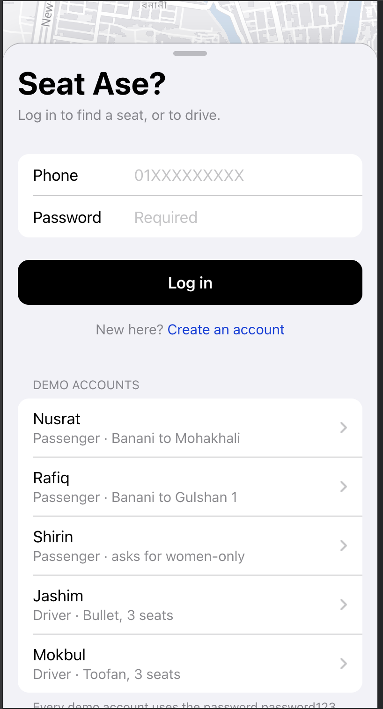
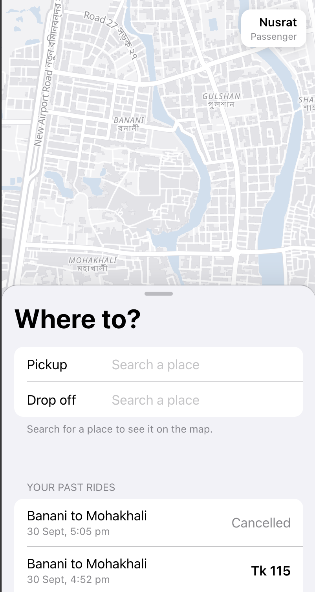
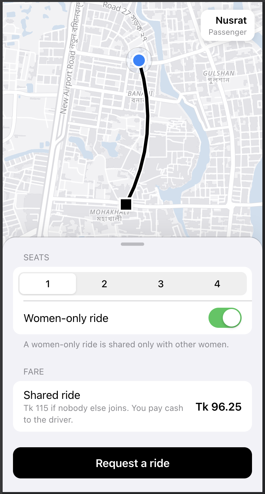
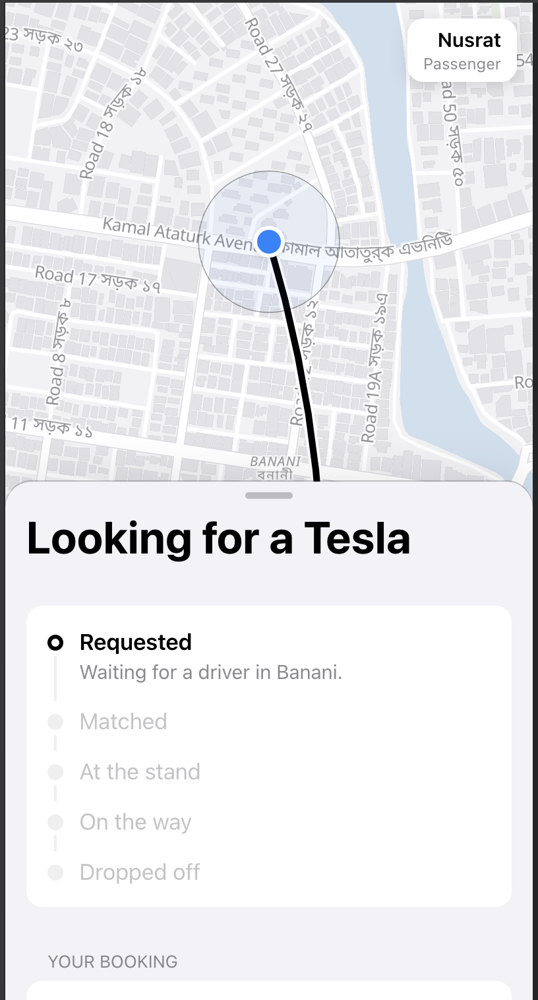
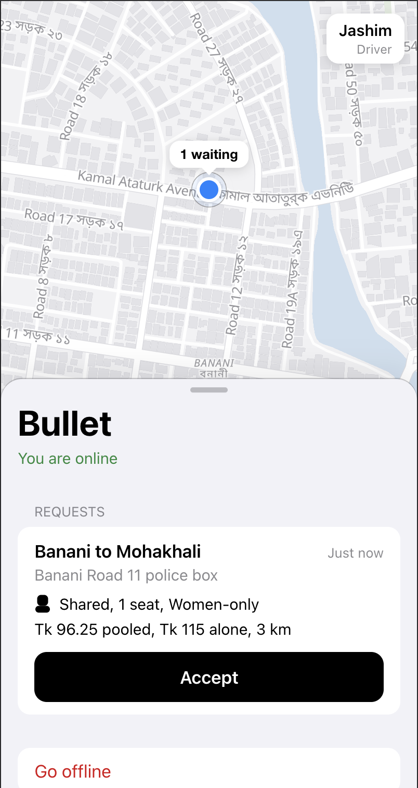
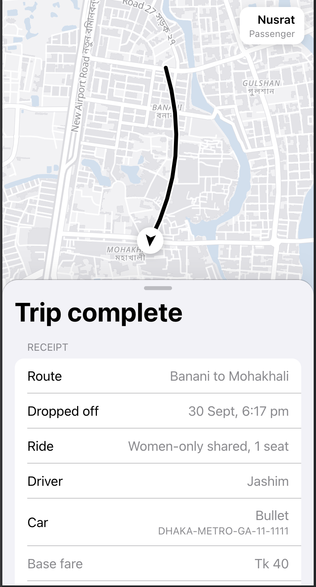
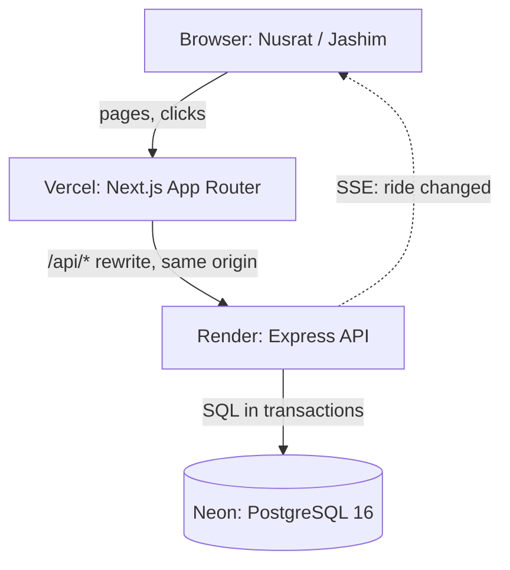
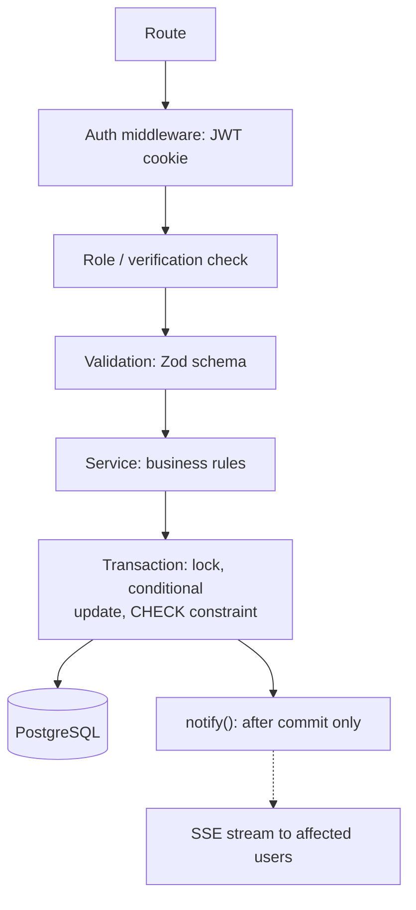
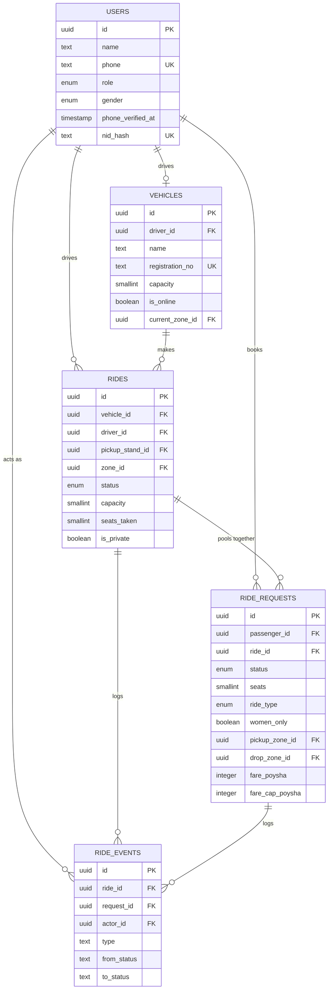
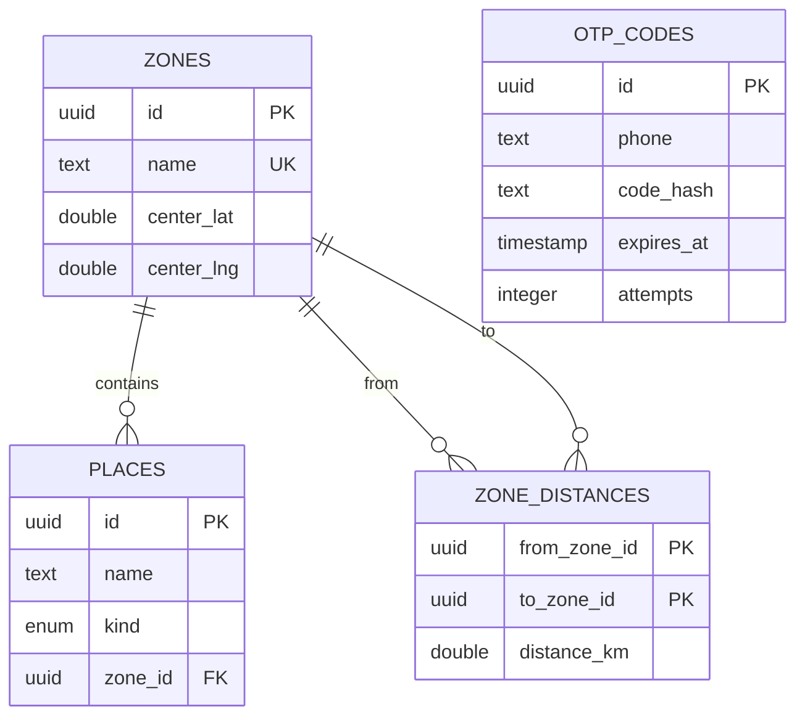

# Seat Ase?

**a Dhaka Tesla Pool MVP.** Find a seat. Find a ride. Stay strangers.

A ride-pooling app for Dhaka's "Teslas": three-wheeled, battery-powered, entirely un-Elon-affiliated auto-rickshaws.
This repository is my take-home submission for the RoBenDevs SWE Intern role.

-  **Live App:** https://seat-ase-web.vercel.app
-  **System Design Document:** [Google Docs](https://docs.google.com/document/d/1QtQkNdZ9xmjYGuJcq-WdbvNtZHhwGTtPMNOFQozNqPI/edit?tab=t.0) (or view the [PDF in this repository](Seat%20Ase_%20System%20Design%2C%20Final%20Version%20(v1.0.0).pdf))
-  **Demo Video:** [Google Drive Walkthrough](https://drive.google.com/file/d/15GDr68LYAWQxFQqWA--mLjnh3vy_7np5/view?usp=sharing)

## 1. The problem

Picture Banani Road 11 at 8:41 AM. Jashim is leaning on Bullet, his three-seat Tesla, waiting for enough passengers to make the trip worth it. Nusrat books a ride to Mohakhali. A couple of minutes later Rafiq, who Nusrat has never met and never will meet after this ride, books a nearly overlapping trip to Gulshan 1. Jashim now has to decide, in about a second, whether the two of them can share his Tesla, and the app has to work out what each of them owes, individually, without either one seeing the other's fare.

That's the whole product: let strangers who are going roughly the same way share a ride and split the cost, without anyone having to be friendly about it. The name captures the actual moment a passenger is in: standing at a stand, wondering if there's a seat.

I built this around the story's cast (Jashim, Bullet, Nusrat, Rafiq, Shirin, and Mokbul as a second driver I added for the two-driver and women-only scenarios) rather than generic `user1`/`driver1` accounts. They show up the same way in the seed data, the tests, and the demo, so nothing drifts apart between what's claimed and what's actually running.

## 2. Features implemented

- Passenger signup, login, and simulated phone (OTP) and NID verification
- Driver signup, vehicle registration, going online/offline with a declared area
- Requesting a shared or private ride, with a live fare estimate before booking
- A women-only option, controlled entirely by the passenger requesting it
- Driver-side pooling: waiting requests are labeled fit or doesn't-fit against the driver's current ride, with the specific reason when they don't
- The full ride lifecycle (arrive, board, start, per-passenger drop-off, no-show handling), using two linked status chains: one for the car, one for each booking
- Concurrency-safe seat allocation (row locks, conditional updates, and a database `CHECK` constraint as the last line of defense), demonstrated live through a built-in Seat Race page
- Idempotent booking creation, so a double-tapped "Request ride" never creates two bookings
- Live updates over Server-Sent Events, with a polling fallback if the connection drops
- A fare receipt that shows the actual math: base + distance − pool discount
- 281 automated tests covering capacity, state transitions, fares, permissions, and the concurrency scenario, run against a database that's never the demo data

## 3. Screenshots

|  |  |
|---|---|
|  |  |
| Login, with one-tap demo accounts for the cast | Choosing pickup and drop-off, with past rides below |
|  |  |
| Seats, the women-only toggle, and the fare before booking | Waiting for a driver, status updates live over SSE |
|  |  |
| The driver's screen: one waiting request, one tap to accept | The finished trip, with driver, car, and fare on the receipt |

## 4. Architecture and database design

>  **System Design Document:** The full system design write-up is available on [Google Docs](https://docs.google.com/document/d/1QtQkNdZ9xmjYGuJcq-WdbvNtZHhwGTtPMNOFQozNqPI/edit?tab=t.0) (and locally as [Seat Ase_ System Design, Final Version (v1.0.0).pdf](Seat%20Ase_%20System%20Design%2C%20Final%20Version%20(v1.0.0).pdf)).

### System architecture



The browser talks only to Next.js, which forwards `/api/*` calls to the Express API on the server side. That means the browser never makes a cross-origin request, so no CORS headers are needed at all. That's a deliberate choice, locked in by a test. The API is stateless, since the JWT cookie carries everything it needs to know about who's asking, so it can be scaled horizontally without any session state to share between instances. Live updates go the other way over SSE: the server pushes a small "something changed" nudge with no actual data in it, and the browser re-fetches through the normal API, so privacy rules only need to live in one place.

### Request flow inside the API



Every write that matters (accepting a request, changing a ride's status, updating seat counts) happens inside a Postgres transaction. One shared transition table decides which actor, driver, passenger, system, or the demo tooling, is allowed to make which status change, and the services ask it before writing rather than trusting a scattered `WHERE status = ...` to stay consistent on its own.

### Database design (ERD)

Split into two diagrams, since all nine tables in one chart rendered too small to read. The first is the ride and booking domain; the second is geography and reference data. Several columns (`current_zone_id`, `pickup_stand_id`, `pickup_zone_id`, `drop_zone_id`) link tables across the two diagrams into `zones` or `places`; those cross-diagram links are called out in the notes below rather than drawn twice.

**Rides and bookings**



**Geography and reference data**



A few notes that don't fit cleanly into either diagram:

- `otp_codes` has no foreign key on purpose. It's matched against `users.phone` directly, since a phone can have an unverified code before an account exists to reference.
- `zone_distances` has a composite primary key on `(from_zone_id, to_zone_id)`; both columns are also foreign keys back to `zones`.
- `vehicles.current_zone_id`, `rides.pickup_stand_id`, `rides.zone_id`, and `ride_requests.pickup_zone_id` / `drop_zone_id` all reference `zones` or `places` from the second diagram; they're first-diagram columns pointing at second-diagram tables.
- A handful of columns are on the real tables but left off these diagrams to keep them readable: `users.password_hash`, `nid_last4`, `nid_verified_at`; `vehicles.last_seen_at`; `rides.arrived_at` / `started_at` / `completed_at`; `ride_requests.pickup_stand_id`, `fare_breakdown`, `idempotency_key`, `body_hash`, `queued_at`, `boarded_at`, `dropped_at`; and `ride_events.details` / `created_at`. All of them are plain columns with no further relationships, listed in full in `api/src/db/schema.js`.
- `role` and `gender` on `users`, `status` on `rides` and `ride_requests`, and `kind` on `places` are Postgres enums with fixed value sets, not free text. `rides.status` is one of `OPEN`, `ARRIVED`, `STARTED`, `COMPLETED`, `CANCELLED`; `ride_requests.status` is one of `REQUESTED`, `MATCHED`, `DRIVER_ARRIVED`, `IN_PROGRESS`, `COMPLETED`, `CANCELLED`, `EXPIRED`, `NO_SHOW`.

A few schema choices worth calling out: `rides.capacity` is a copy of `vehicles.capacity` taken at creation time, since a `CHECK` constraint can only see columns on its own row, and enforcing "seats taken never exceeds capacity" needs both values on `rides` itself. `rides_one_active_per_vehicle` and `ride_requests_one_active_per_passenger` are partial unique indexes rather than plain constraints, since "at most one active row" only makes sense while the status is still OPEN/ARRIVED/STARTED or REQUESTED/MATCHED/DRIVER_ARRIVED/IN_PROGRESS; a finished ride or booking shouldn't count against that limit.

## 5. Tech stack, and why

| Layer | Choice | Why this one |
|---|---|---|
| Language | Plain JavaScript (no TypeScript), Zod for runtime checking | The dangerous bugs here (overbooking, illegal status jumps, one user touching another's ride) happen with real data while the app is running. TypeScript checks the code as I write it and disappears at runtime; Zod checks every real request, and the database checks every real write. Zod schemas are shared between frontend and backend, so there's one definition of what counts as a valid ride request. |
| Frontend | Next.js 16 (App Router), React 19, Tailwind CSS 4 | File-based routing is easy to reason about, and the built-in rewrite is what lets `/api/*` calls stay same-origin. |
| Backend | Express 5 | I know it well enough to explain every line, and a separate Express app keeps a clean split between "what the screen shows" and "what the rules are." |
| Database | PostgreSQL 16 | This app is really about relationships and safe counting: a request belongs to a ride, a ride belongs to a car, seats can never exceed capacity. Postgres gives me foreign keys, `CHECK` constraints, partial unique indexes ("a driver can only have one active ride"), and row locks for free. A document store would push all of that enforcement into application code instead of the database. |
| ORM / migrations | Drizzle ORM + drizzle-kit | Queries read close enough to SQL that I can explain exactly what hits the database, and `drizzle-kit` generates plain `.sql` migration files that are easy to read directly rather than hidden behind a black box. |
| Auth | Our own bcrypt + JWT in an httpOnly cookie | The rules live in Express, not in Next.js, so an auth library built for Next.js would mean splitting login logic across two apps. Our own implementation is short enough that I can walk through every line of it in an interview. |
| Validation | Zod, in a package shared by both apps | One schema, two uses: the form gives instant feedback, and the API rejects bad data the same way either time. |
| Live updates | Server-Sent Events, with polling as a fallback | Updates only need to flow server → browser. SSE is built into every browser, reconnects on its own, and needs no extra library or paid service. |
| Map | MapLibre GL JS with OpenFreeMap tiles | Free, no API key, no rate limit, and fully restylable so the map can match the rest of the app instead of sitting in its own card. |
| Testing | Vitest + Supertest, against a real Postgres | The riskiest code here is database behavior, locks and constraints, and a mocked database can't prove that two simultaneous requests don't overbook a Tesla. Supertest calls the real Express app over HTTP without opening a port, so tests exercise the endpoints exactly the way the frontend does. |
| Hosting | Vercel (web) + Render (API) + Neon (Postgres), all free tiers | No card required at this scale, and the same Dockerfile that runs locally runs on Render, so "works on my machine" and "works online" stay the same thing. |

## 6. Project structure

```
Seat-Ase/
├── api/
│   ├── src/
│   │   ├── app.js, server.js       # Express app and entry point
│   │   ├── config/                 # env loading and validation
│   │   ├── controllers/            # thin: read the request, call a service, respond
│   │   ├── services/                # all the business rules live here
│   │   ├── middleware/              # auth, role checks, validation, error handling
│   │   ├── db/                      # Drizzle schema, migrations, seed data
│   │   ├── realtime/                 # SSE connections and the notify() function
│   │   ├── routes/                   # URL → controller wiring
│   │   ├── lib/                      # small shared helpers (hashing, geo, etc.)
│   │   └── test/                     # test database setup and helpers
│   └── drizzle/                      # generated .sql migrations
├── web/
│   ├── app/                          # Next.js App Router pages
│   ├── components/                   # UI components
│   └── lib/                          # API client, TanStack Query hooks, live-update hook
├── shared/                            # Zod schemas used by both api and web
├── postman/                           # a runnable collection for the whole demo flow
└── docker-compose.yml
```

## 7. Prerequisites

- Docker and Docker Compose (for the one-command path)
- Node.js 22+ and a reachable Postgres instance, if you'd rather run it without Docker or want to run the test suite

## 8. Environment variables

All of these are documented with placeholder values in `.env.example`. Copy it to `.env` for local development; `.env` itself is never committed.

| Variable | Purpose | Notes |
|---|---|---|
| `DATABASE_URL` | Postgres connection string | must start with `postgres://` |
| `JWT_SECRET` | signs login session tokens | rotate freely; production requires at least 32 characters and refuses the example value |
| `NID_PEPPER` | HMAC key for the NID fingerprint (enforces one NID, one account) | set once and never change, since old fingerprints can't be recomputed with a new key; 32+ characters in production |
| `DEMO_KEY` | header key required by the `/dev` demo routes (Seat Race) | 32+ characters if `DEMO_MODE=true` in production; not published in this README — submitted with this assignment, in the Google Form's "Additional Supporting Link" field |
| `DEMO_MODE` | shows the OTP code on screen instead of sending an SMS | `true` locally and in the demo deployment; would be `false` with a real SMS provider |
| `COOKIE_SECURE` | marks the session cookie HTTPS-only | `false` on localhost, `true` in production |
| `SSE_HEARTBEAT_MS` | how often a live-update heartbeat is sent | default 25000 |
| `LOG_LEVEL` | `error` / `warn` / `info` / `http` / `debug` | default `http` |
| `PORT` | API listen port | default 4000; Render sets its own |
| `DB_PORT` / `API_PORT` / `WEB_PORT` | Docker Compose published ports | optional, default 5432 / 4000 / 3000 |

Render refuses to start in production if `JWT_SECRET`, `NID_PEPPER`, or (when `DEMO_MODE=true`) `DEMO_KEY` are missing, too short, or left at the example value.

## 9. Running it locally

```bash
git clone https://github.com/ShajidShahriar/Seat-Ase.git
cd Seat-Ase
docker compose up -d --build
```

Open `http://localhost:3000`. The API container runs migrations and seeds the demo data automatically on every start, and it's safe to restart or rebuild without duplicating anything.

If a port is already in use (5432 is a common one to already have a local Postgres on):

```bash
DB_PORT=5433 API_PORT=4001 WEB_PORT=3002 docker compose up -d --build
```

### Running without Docker

```bash
npm run dev:api   # :4000
npm run dev:web   # :3000, proxies /api/* to :4000
```

### Running the tests

```bash
docker compose up -d db
npm ci
npm test
```

(add `DB_PORT=...` before `npm test` if you changed it above.) The suite creates its own `seatase_test` database the first time it runs and never touches the demo data.

## 10. Demo credentials

Password for every account: `password123`

| Name | Role | Phone | Notes |
|---|---|---|---|
| Nusrat | Passenger, female | 01700000030 | Banani → Mohakhali |
| Rafiq | Passenger, male | 01700000031 | Banani → Gulshan 1 |
| Shirin | Passenger, female | 01700000032 | Banani → Mohakhali, usually requests women-only |
| Jashim | Driver | 01700000010 | Drives Bullet, plate DHAKA-METRO-GA-11-1111, 3 seats |
| Mokbul | Driver | 01700000011 | Drives Toofan, plate DHAKA-METRO-GA-22-2222, 3 seats |

Everyone above is pre-verified (phone and NID). Fixed fares these accounts should produce, in poysha (100 poysha = 1 Tk), so they can be checked by hand:

- Nusrat pooled: 9625 · Rafiq pooled: 7750 · Nusrat riding alone: 11500 · Nusrat hiring the whole Tesla privately: 34500
- Banani ↔ Mohakhali: 3.0 km · Banani ↔ Gulshan 1: 2.0 km · Mohakhali ↔ Gulshan 1: 2.5 km · Banani ↔ Tejgaon: 4.0 km

If more than one person is testing at the same time, please don't log in as the same demo account simultaneously. The app enforces one active booking per passenger and one active ride per car, so two evaluators sharing Nusrat's account will collide with each other. Signing up a fresh account works fine alongside the seeded cast.

## 11. Deployment

- **Web app:** https://seat-ase-web.vercel.app
- **API:** hosted on Render, reached only through the web app's same-origin `/api` rewrite; nobody needs the direct API URL
- **Database:** Neon (Postgres 16)

The API runs on Render's free tier, which sleeps after about 15 minutes with no traffic. A free uptime monitor pings it every 5 minutes to keep it mostly awake during evaluation. If the very first request does hit a cold start, the app shows a "waking up" message and retries on its own rather than showing an error, so there's no need to refresh manually, though it takes 30 to 45 seconds the first time.

## 12. API overview

**Auth:** `POST /auth/signup`, `POST /auth/login`, `POST /auth/logout`, `GET /auth/me`, `POST /auth/otp/send`, `POST /auth/otp/verify`

**Places and fares:** `GET /places`, `GET /zones`, `GET /zones/:zoneId/online-count`, `POST /places/nearest-stand`, `POST /fares/estimate`, `POST /fares/quote`

**Passenger:** `POST /requests`, `GET /requests`, `GET /requests/:id`, `POST /requests/:id/cancel`, `GET /requests/:id/timeline`, `GET /requests/:id/ride`

**Driver:** `POST /driver/vehicle`, `GET /driver/vehicle`, `POST /driver/online`, `POST /driver/offline`, `GET /driver/requests`, `POST /driver/ride/requests/:id/accept`, `POST /driver/ride/arrived`, `POST /driver/ride/requests/:id/board`, `POST /driver/ride/requests/:id/no-show`, `POST /driver/ride/start`, `POST /driver/ride/requests/:id/drop`, `POST /driver/ride/cancel`, `GET /driver/ride`, `GET /driver/history`

**Live updates:** `GET /events/stream` (Server-Sent Events)

**Demo only** (needs `DEMO_MODE=true` and an `X-Demo-Key` header): `POST /dev/scenario/:name`, with `reset`, `seat-race`, and `two-drivers` as the three named scenarios

A runnable Postman collection covering the whole flow (signup through a completed pooled ride) is in `postman/`.

## 13. Key decisions and trade-offs

The design went through six or seven versions before I settled on the one this repo actually implements. Each version is dated, with what changed and why. The full history is in the [System Design Document](https://docs.google.com/document/d/1QtQkNdZ9xmjYGuJcq-WdbvNtZHhwGTtPMNOFQozNqPI/edit?tab=t.0) (and locally in [Seat Ase_ System Design, Final Version (v1.0.0).pdf](Seat%20Ase_%20System%20Design%2C%20Final%20Version%20(v1.0.0).pdf)). What's below is a summary: the key decisions and trade-offs from the final version, plus a few rule changes I made after building had already started, once the code surfaced a problem the design hadn't accounted for.

- **A driver can never re-accept a booking he personally cancelled.** Early on, nothing stopped a driver from cancelling a whole ride and immediately re-accepting everyone except the one passenger he didn't want, which is a kick-out through the back door and exactly what the "no kick-out" rule was supposed to prevent. The fix reuses the ride's own event history instead of adding a new timer: if a `RIDE_CANCELLED` event exists with that driver as the actor for that specific booking, he can't take it back. There's no expiry to track, and it's scoped to that one booking; if the passenger books again later, that's a fresh booking and any driver can take it.
- **Private rides are picked up at the stand, like shared rides**, rather than at the passenger's door. "Private" only means the whole Tesla is reserved for one booking, not a different pickup experience.
- **Private fares are always priced as if the Tesla has 3 seats**, even for a driver who registered a bigger one. This keeps the quoted price from ever rising after a passenger has already seen it. A driver with a 6-seat car doesn't earn more for a private hire in the current build.
- **A 15-minute deadline for the driver to actually reach the stand.** If he accepts a request but doesn't press "arrived" within 15 minutes, the ride cancels and everyone goes back to the waiting list with a fresh queue position. The driver's screen shows a live countdown to this deadline rather than letting it expire silently.
- **Free-form map pins were removed.** Pickup and drop-off are chosen only through search and the suggestion list now. An untagged point dropped on the map had no sensible name to show anywhere else in the app, and search covers everything the demo needs.
- **Sessions are stateless, 7-day sliding JWTs**, so the same account can be logged in on any number of devices at once. Correctness comes from database constraints instead: one active booking per passenger, one active ride per vehicle. There's no "log out everywhere" yet. The fix would be a `token_version` column on each user, bumped to invalidate every existing token at once, which I've scoped but not built; I'd rather spend the remaining time on deployment and testing than on a feature nothing in the brief asks for.
- **The zone-distance table mixes two sources.** Six distances that the fixed demo scenarios depend on are set by hand to match the design document exactly. The other roughly 60 zone pairs are estimated from straight-line distance, then passed through a shortest-path pass so no detour through a third zone is ever cheaper than the direct trip. The result is an estimate rather than a set of measured distances, and worth saying plainly so the precision isn't overstated.
- **MapLibre with OpenFreeMap tiles**, rather than the Leaflet + OpenStreetMap combination I'd originally planned, because it's fully restylable and lets one persistent map sit behind the whole app instead of a separate map per screen.
- **No CORS package or headers at all.** The browser only ever talks to the API through the Next.js same-origin rewrite, so this is the strictest possible setting, chosen on purpose, and a test locks it in.

## 14. Known limitations

- **NID and gender verification are simulated, not real.** Any syntactically valid 10, 13, or 17-digit number is accepted as an NID, and in demo mode the OTP code is shown on screen instead of being sent by SMS. This catches accidental duplicate signups, but it wouldn't stop someone deliberately lying about their identity or gender to get into a women-only ride. A production build would check against a real ID registry and send real SMS.
- **Pickup is always the straight-line nearest Tesla stand.** If a Tesla happens to be filling up at a slightly farther stand in the same area, the passenger currently isn't shown that option. Letting her choose among nearby stands and see which one actually has room is a reasonable next step.
- **One role per account.** A driver can't also have a passenger account, since the same NID can't register twice.
- **No in-app way to contact the other person.** No masked calling, no chat. A late passenger or a driver at the wrong corner of the stand has no way to say so beyond what the status screen already shows.
- **A few cleanup jobs run lazily, on read, rather than as scheduled background jobs.** Expiring stale requests and closing abandoned rides work this way, for instance, and a couple of lookup tables are queried directly rather than cached. That's fine at demo scale and is discussed further in the scaling section below.
- **Signup and login are rate-limited per phone number, not globally**, so a large number of distinct, never-seen-before phone numbers could still generate load. Not a real concern at demo scale.
- **Registering a phone number, NID, or vehicle plate reserves it immediately, even before verification finishes.** Someone could tie up a number or plate they don't actually control. A production build would let unverified reservations expire after a day or so.

## 15. Next improvements

- Real driver location tracking (the current build has drivers self-declare which area they're in, which updates to wherever their last drop-off was)
- Letting a passenger pick from several nearby stands instead of only the single nearest one
- A "log out everywhere" mechanism via the `token_version` approach described above
- Real SMS delivery and real NID registry verification
- A basic in-app way for a driver and passenger to signal "I'm here" or "running late"
- Scheduled background jobs for the cleanup work that's currently lazy, once traffic makes that worth doing

## 16. Testing

The brief asks for six specific things to be covered, and I've mapped tests to each of them directly rather than chasing coverage numbers for their own sake:

| What the brief asks for | How it's tested |
|---|---|
| A Tesla's capacity can never be exceeded | Fill Bullet to capacity with real bookings, then attempt one more accept: refused. A direct attempt to write `seats_taken` past `capacity` is also rejected, by the database `CHECK` constraint itself, independent of the application code |
| Invalid state transitions are rejected | Every legal and illegal move through the ride and booking lifecycle is checked against the shared transition table, both directly and by hitting the actual endpoints in an illegal order (starting a ride that hasn't arrived, completing one that hasn't started, and so on) |
| Nusrat's and Rafiq's pooled fares calculate correctly | Fixed values, checked exactly: Nusrat 9625 poysha, Rafiq 7750 poysha, matching the numbers in this README |
| A user can't touch another user's ride | Attempts to read or act on someone else's booking or ride return 404, not 403, so a user can't even confirm that another person's ride exists |
| Cancellation rules hold | Cancelling before a driver arrives frees the seat immediately; cancelling after arrival is blocked (with a documented escape hatch if the driver never actually starts the trip); a driver cancelling a whole ride correctly resets every passenger on it, including clearing any "boarded" state so nobody is left in limbo |
| Two concurrent requests can't corrupt pool capacity | The last-seat scenario is fired as two real, simultaneous HTTP requests. Exactly one succeeds, the other gets a clear conflict response, and the resulting seat count is verified against the database directly |

281 automated tests in total, run with Vitest and Supertest against a real Postgres instance dedicated to testing, never the demo database.

## 17. The concurrency problem

Bullet has one seat left. Nusrat and Shirin both try to take it at nearly the same instant, and both requests see "1 seat free" before either one has written anything. Left alone, that's how a three-seat Tesla ends up with four passengers.

I handle it with three layers, each one a backstop for the layer above it:

1. **A row lock on the ride.** The accept runs inside a transaction that opens with `SELECT ... FROM rides WHERE id = $1 FOR UPDATE`. The second request has to wait at that line until the first one finishes and commits, and only then does it read the actual, current seat count.
2. **Conditional updates.** The booking claim only succeeds `WHERE status = 'REQUESTED'`, and the seat update only succeeds `WHERE seats_taken + $seats <= capacity`. If either condition is no longer true by the time the statement runs, zero rows change and the whole transaction rolls back.
3. **A database `CHECK` constraint** (`seats_taken <= capacity`) as the absolute last line of defense. Even a bug in the application code can't write a value past it, because Postgres itself refuses the row.

I proved this holds by deliberately removing the row lock from the accept function and rerunning the full test suite: nothing failed, because the conditional update and the `CHECK` constraint alone were still enough to keep exactly one request winning. That's genuinely useful to know. The lock is one layer among three keeping the seat count correct, and I'd rather understand that honestly than assume the outermost layer is doing all the work.

The losing request gets back a clear, specific conflict response rather than a generic error, and nothing about its own state changes: it's exactly as if the accept never happened. All of this is demonstrated live on the app's built-in Seat Race page, which fires two real simultaneous accepts and shows both transactions' start times, which one won, and the resulting event log.

At a larger scale I'd keep the same approach. Locks scoped to one ride at a time mean a hundred thousand drivers never block each other; only two people actually fighting over the same Tesla do. On top of that I'd add retry-with-backoff on the conflict response, lock-wait metrics, and, if automated matching ever gets busy enough to need it, one matcher process per city zone so each zone's decisions serialize in memory instead of at the database.

## 18. Bonus: scaling to 1M passengers, 100k drivers

This section stayed reasoning-only on purpose. The brief is explicit that adding Redis, queues, or Kubernetes to an MVP just to look impressive is the wrong move, so nothing below is actually built. What follows is how I'd grow the current design if it needed to, and which of today's choices already make that growth cheap.

### Where the load actually is

Working the numbers through (1M passengers, 15% riding on a weekday, half of that concentrated into four rush hours) the booking traffic itself comes out tiny: roughly 25 new requests and 25 accepts per second at peak. One ordinary Postgres instance handles that without strain, and the row-lock design already used for the seat count would hold up fine here.

What actually breaks first is everything that isn't a booking. With 100k drivers and half of them online at rush hour, live location pings alone would run around 10,000 a second, and between drivers and waiting or riding passengers there'd be something like 110,000 open live-update connections at once. The honest scaling story is scaling the parts that break and leaving the parts that already work alone.

### What I'd add, and in what order

| Users | What changes | Why then, not sooner |
|---|---|---|
| ~10k | A few copies of the API behind a load balancer; Postgres's own `LISTEN`/`NOTIFY` to pass live-update nudges between API instances | No new infrastructure needed, since Postgres already does this |
| ~100k | Redis for pub/sub and rate limiting, a read replica for history and driver-feed queries, a queue for SMS sending | Read load and SSE connection count start to matter |
| ~1M | A dedicated location service (Redis's geospatial commands, driver positions grouped into hex cells), a separate tier of servers just for holding live-update connections, matching split by zone | Location writes are the first thing to actually choke a single Postgres instance |
| Multi-city | A separate database per city | One primary can no longer take the combined write volume |

### What today's MVP already sets up for that growth

A handful of choices in the current build aren't just simplicity for its own sake. They're specifically what makes the table above cheap later instead of requiring a rewrite:

- The JWT is stateless and the API keeps no session state, so running more copies of it is just running more copies, with nothing to synchronize between them.
- Every seat lock is scoped to one ride, not global, so drivers who aren't competing for the same Tesla never wait on each other, at any scale.
- Every live-update nudge goes through one `notify()` function, so swapping in-memory delivery for `LISTEN`/`NOTIFY` and eventually Redis is a change in one file, not a change everywhere a nudge is sent.
- The same is true for OTP sending: one `sendOtp()` function stands between the rest of the app and whatever actually delivers the code.
- Idempotency keys are already in place, which matters more at scale, since a network that fails constantly needs retries to be safe by default.
- `ride_events` is already an append-only history table, so it could feed an analytics pipeline or an event stream later without touching the booking logic that writes to it.

Two things worth being honest about rather than overselling. The plain lookup indexes this design would eventually want (on the waiting list by zone, on a passenger's history, on events by ride) are mostly missing; only the ones a uniqueness constraint actually requires exist right now. And the small numeric rules scattered through the services (the 3 km pooling radius, the 15-minute expiry, the 5-minute no-show wait) are named constants set in code, rather than environment variables. Turning them into per-city settings you can tune without redeploying is a further step from here.

### What I'd expect to fail, and what happens when it does

A server dying mid-accept is the easy case: the transaction never committed, so Postgres rolls the whole thing back and no seat is half-booked. If Redis went down at the 100k stage, live updates would fall back to polling. That's slower, but it's the same fallback the MVP already uses today if an SSE connection drops. A dead primary gets a replica promoted, which managed Postgres providers handle on their own. An SMS provider going down means OTP jobs sit in the queue and retry with growing delays rather than hammering a service that's already struggling. And for the case where nothing crashes but something is quietly wrong, a slow query, a rising conflict rate, that's what request-scoped logging, latency percentiles, and a "how often are accepts hitting a conflict" metric are for. None of that exists yet either, but it's the natural next thing to add once there's real traffic to watch.

## 19. AI usage

I used two AI tools on this project, for two different jobs.

**Claude** did most of the actual thinking with me. I used it to brainstorm the system design itself, which went through six or seven versions before I settled on the one this repo implements (see Section 13 for the summary, and `devlog.md` for the full session-by-session record). Later, once the design was built, I had it do a structured review of the finished code against that design, which surfaced around 66 gaps and bugs. I worked through that list in priority order rather than all at once.

Every piece of code and every decision was checked manually before it went anywhere near a commit. For anything Claude helped write, I verified it by writing test cases with it, running them, and only committing and pushing once they  passed.

**GitHub Copilot**, through VS Code's commit-message shortcut, wrote most of the actual commit messages. It reads the staged diff directly, and the results were explanatory enough on their own that I didn't need to rewrite them by hand for most commits.

Two examples the brief specifically asks for:

**Accepted, and changed along the way.** For hashing the NID (so the system can enforce one NID per account without ever storing the number itself), the first instinct was bcrypt, since that's what the passwords already use. That's wrong for this specific job: bcrypt salts randomly every time, so hashing the same NID twice gives two different results, which is useless for a uniqueness check. A plain SHA-256 hash would be deterministic but far too weak on its own, since a 10-digit number only has 10 billion possibilities to search through. What I actually used is HMAC-SHA256 keyed with a server secret: deterministic, so the database constraint still catches a genuine duplicate, but not something an attacker could precompute without also knowing that key.

**Rejected, in favor of something simpler.** The design review suggested that a driver who cancels a ride and loses a passenger shouldn't be able to re-accept that same passenger for 15 minutes, closing a kick-out loophole. I built it differently: instead of a time window, the fix checks whether a cancellation event already exists for that specific driver and that specific booking, with no expiry attached at all. It needed no new timer or configuration value to explain, and it's scoped more precisely to what the rule is actually protecting against. If the same passenger books again later, that's a genuinely new booking, and any driver, including the one who cancelled before, can take it.

`devlog.md` has the complete roadmap and log: every session, what I built, what broke, what got fixed, what got invented along the way. Reviewers are welcome to go through it directly rather than take my summary of it here on faith.

## 20. Demo video

-  **Video Walkthrough:** [Watch the demo on Google Drive](https://drive.google.com/file/d/15GDr68LYAWQxFQqWA--mLjnh3vy_7np5/view?usp=sharing)
